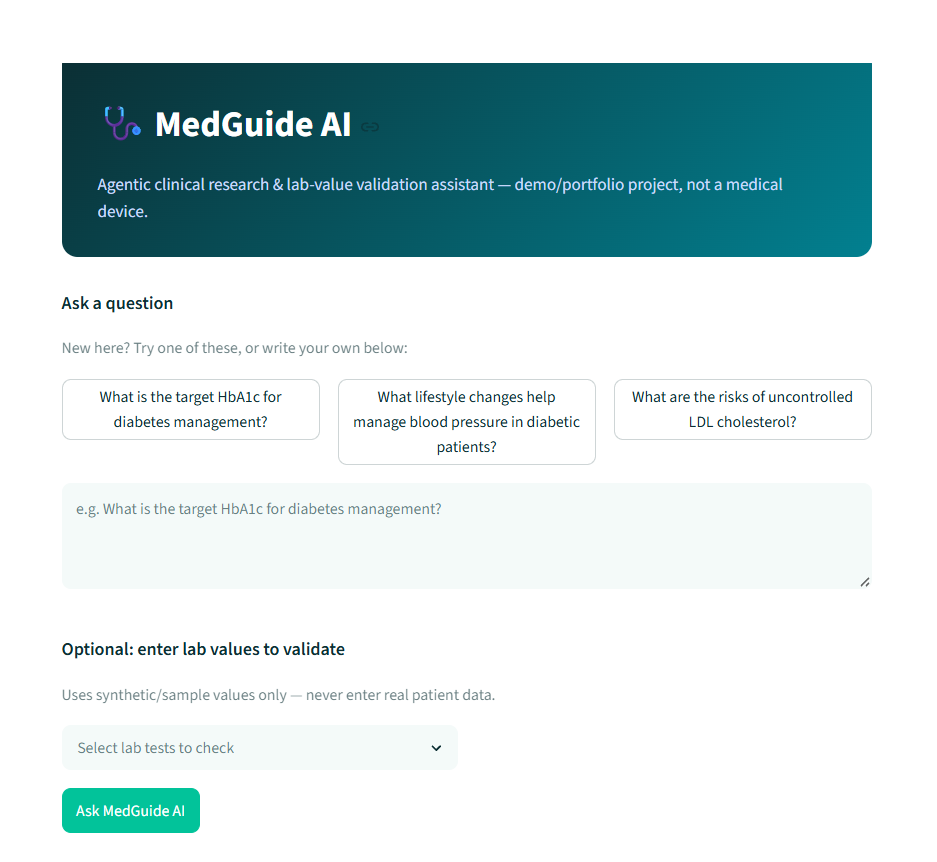
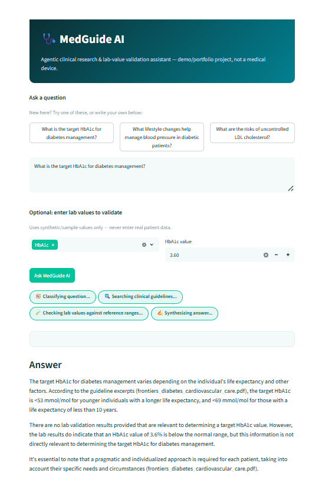
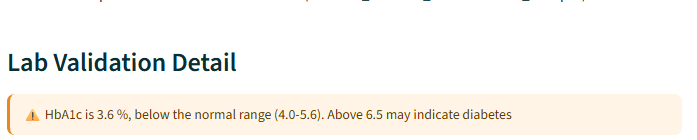

# 🩺 MedGuide AI


**An agentic clinical research & lab-value validation assistant** — built as a 10-day capstone for the AB Talks 60-Day Claude AI Challenge.

🔗 **Live demo:** https://medguide-ai-7nzbirzxqusphhecrkvbns.streamlit.app/
> Note: free-tier hosting may take a few seconds to "wake up" if the app has been idle.

---

## What it does

MedGuide AI answers clinical/medical questions using **retrieval-augmented generation (RAG)** over real, public clinical guideline documents — every answer cites its source. It can also **validate lab test values** against reference ranges and flag anomalies in plain English. A visible, step-by-step agent (built with LangGraph) shows exactly how it reasons through each question — not a black box.

This is a **demo/portfolio project, not a medical device.** It uses public guideline PDFs and synthetic (clearly fake) lab data only — never real patient information.

## Screenshots

| Landing & Question Input | Live Agent Reasoning | Lab Validation |
|---|---|---|
|  |  |  |

*(Screenshots captured from the live production deployment — see `docs/screenshots/` for full-size images.)*

## Key features

- 📚 **Cited research Q&A** — ask a question, get an answer grounded in ingested clinical guidelines, with the source PDF cited
- 🧪 **Lab value validation** — submit lab values, get flagged anomalies against reference ranges with plain-English explanations
- 🧭 **Visible agent reasoning** — watch each step (classify → search → validate → synthesize) rather than a single opaque LLM call
- 🌐 **Fully free to run** — no paid APIs or hosting

## Tech stack

| Layer | Choice |
|---|---|
| Frontend | Streamlit |
| Orchestration | LangChain + LangGraph |
| LLM | Groq (Llama 3.3, free tier) |
| Embeddings | Hugging Face `sentence-transformers/all-MiniLM-L6-v2` (local, free) |
| Vector store | Chroma (embedded) |
| Hosting | Streamlit Community Cloud (free) |

## Architecture

See [`docs/ARCHITECTURE.md`](docs/ARCHITECTURE.md) for full component diagrams, data flow, and the agent's state machine.

```
User → Streamlit UI → LangGraph Agent → [Chroma Retriever + Lab Validator] → Groq LLM → Cited Answer
```

## Running it locally

```bash
git clone https://github.com/Nidhisingh274/medguide-ai.git
cd medguide-ai
python -m venv venv
venv\Scripts\activate          # Windows
# source venv/bin/activate     # Mac/Linux
pip install -r requirements.txt
```

Create a `.env` file in the project root:
```
GROQ_API_KEY=your_groq_api_key_here
```

Run it:
```bash
python -m streamlit run app.py
```

## Project structure

See [`docs/PROJECT-STRUCTURE.md`](docs/PROJECT-STRUCTURE.md) for a full folder-by-folder breakdown.

## Documentation

Full design docs, PRD, and the story behind this build are in [`docs/`](docs/), including:
- [`docs/challenge-retrospective.md`](docs/challenge-retrospective.md) — the full Day 1-10 build journey
- [`docs/future-scope.md`](docs/future-scope.md) — where this project goes next
- [`docs/30-day-growth-plan.md`](docs/30-day-growth-plan.md) — a roadmap beyond v1.0.0

## About the builder

Built by Nidhi Singh, an AI/ML engineer with a background in healthcare at ICMR (India's national medical research body) — this project's lab-validation feature is directly inspired by that real-world experience.

## License

MIT — see [`LICENSE`](LICENSE).

---
*Built with Claude as part of the AB Talks 60-Day Claude AI Challenge.*
