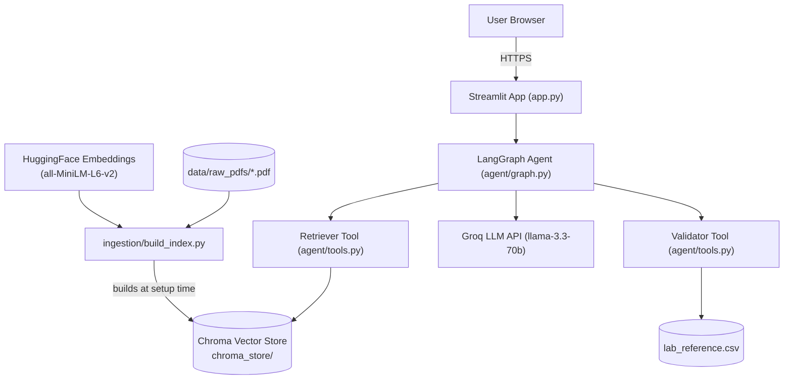
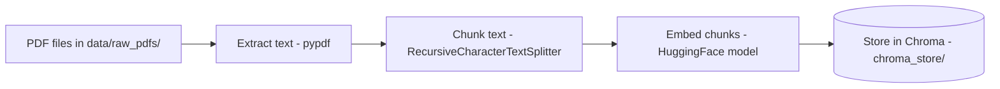
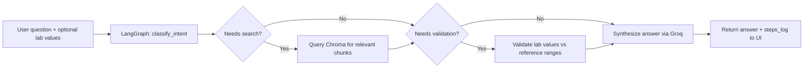
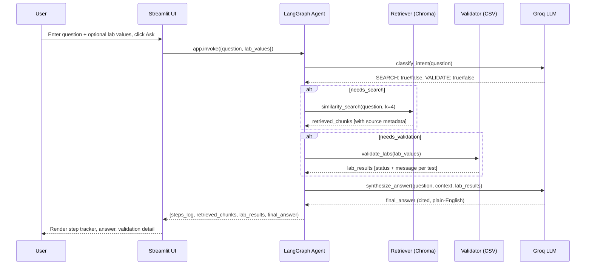
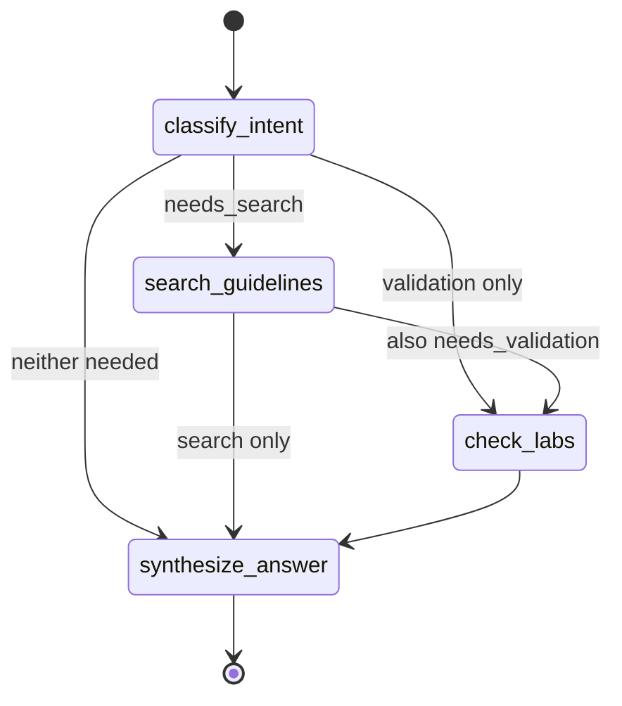

# MedGuide AI — System Architecture

**Status:** Locked Day 2. Do not change without updating the PRD and Implementation Blueprint first.

## 1. Overview

MedGuide AI is a **monolithic Streamlit application** — there is no separate backend server. `app.py` calls a LangGraph agent in-process, which calls two tools (a retriever and a validator) and one external API (Groq). The vector store is built once, offline, by `ingestion/build_index.py`, and only *read* at runtime.

## 2. Component Diagram

## 3. Data Flow

### 3.1 Ingestion-time flow (run once, before deployment — not per user request)

### 3.2 Query-time flow (runs on every user question)

## 4. Request Lifecycle (Sequence Diagram)

## 5. AI Interaction — Agent State Machine

## 6. External Services

| Service | Purpose | When called | Free tier limits to be aware of |
|---|---|---|---|
| Groq API | LLM inference (routing + synthesis) | Every user query | Rate limits apply — handled via `safe_llm_call` (Day 8) |
| HuggingFace Hub | Download embedding model | Once, at first run/deploy | Model cached locally after first download |
| GitHub | Source control, triggers deployment | Every `git push` | None (public repo) |
| Streamlit Community Cloud | Hosting | Continuous (live app) | App may sleep after inactivity — noted in README |

## 7. Why This Architecture (Not a Client-Server Split)

A traditional frontend/backend/database split was deliberately rejected on Day 1:

- **No user accounts** → no need for a database or auth layer
- **Single-user demo, not a multi-tenant product** → a separate REST API server would add operational complexity (hosting, CORS, auth tokens) with zero benefit
- **Time budget is 3-4 hrs/day for 10 days** → every architectural layer we don't need is time we can't afford to spend

This is a monolith by design, not by oversight.
