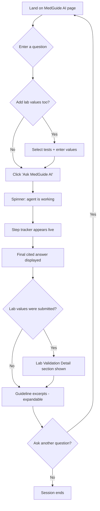

# MedGuide AI — UI & User Flow

**Status:** Locked Day 2. Do not change without updating the PRD and Implementation Blueprint first.

## 1. User Flow Diagram



## 2. Screen Flow

Since there's no login and no multi-user accounts, MedGuide AI is intentionally **a single page with four UI states**, not multiple screens/routes:

1. **Landing/Input state** — empty question box, optional lab form, sidebar visible
2. **Loading state** — spinner + "Working..." while the agent runs
3. **Results state** — step tracker, answer, lab detail, source excerpts
4. **Error state** — friendly message if something fails (hardened Day 8)

## 3. Wireframes (Low-Fidelity)

### State 1 & 2 — Landing / Loading

```
┌─────────────────────────────────────────────┬───────────────┐
│ 🩺 MedGuide AI                               │ SIDEBAR       │
│ Agentic clinical research & validation demo  │ About project │
│                                               │ Tech stack    │
│ Ask a question                               │ GitHub link   │
│ ┌───────────────────────────────────────────┐│ ⚠️ Disclaimer │
│ │ [ free text area ]                        ││               │
│ └───────────────────────────────────────────┘│               │
│                                               │               │
│ Optional: enter lab values to validate        │               │
│ [ multiselect: choose tests ]  [value] [value]│               │
│                                               │               │
│           [ Ask MedGuide AI ]                 │               │
│                                               │               │
│  ⏳ Working...  (spinner, once clicked)        │               │
└─────────────────────────────────────────────┴───────────────┘
```

### State 3 — Results

```
┌─────────────────────────────────────────────┬───────────────┐
│ Agent steps:                                 │ SIDEBAR       │
│  🧭 Classifying question...                   │ (unchanged)   │
│  🔍 Searching clinical guidelines...          │               │
│  🧪 Checking lab values...                    │               │
│  ✍️ Synthesizing answer...                    │               │
│ ───────────────────────────────────────────  │               │
│ Answer                                       │               │
│  [ synthesized, cited answer text ]          │               │
│                                               │               │
│ Lab Validation Detail                        │               │
│  ✅ HbA1c is 5.2% — within normal range       │               │
│  ⚠️ Glucose is 132 mg/dL — above normal range │               │
│                                               │               │
│ ▸ Show retrieved guideline excerpts (expander)│               │
└─────────────────────────────────────────────┴───────────────┘
```

### State 4 — Error

```
┌─────────────────────────────────────────────┐
│ ⚠️ Something went wrong: [readable message]   │
│    Please try again in a moment.             │
└─────────────────────────────────────────────┘
```

## 4. Navigation

None needed — single page, no routing, no login. This is intentional simplicity that matches the PRD's out-of-scope list (no accounts, no multi-page app). Every element on the page exists for one of the two core features (Q&A or lab validation) or for portfolio context (sidebar).
